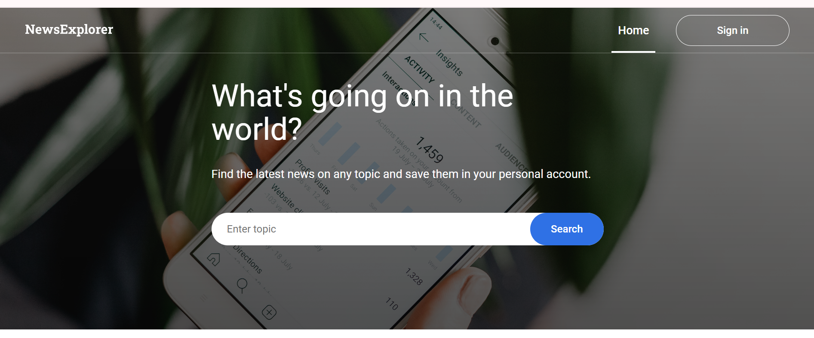
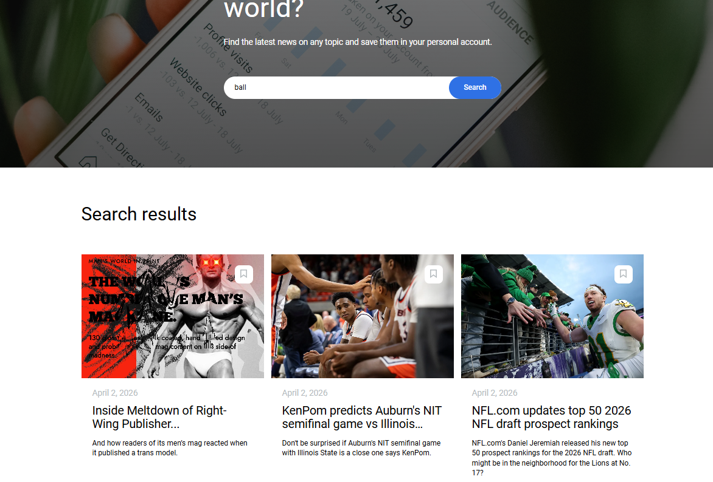
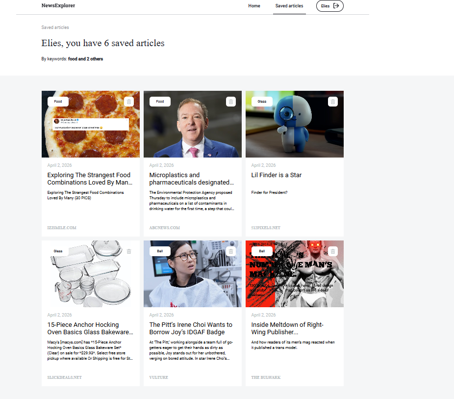
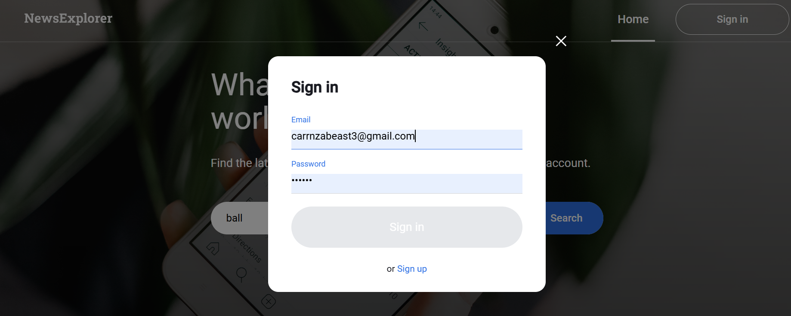
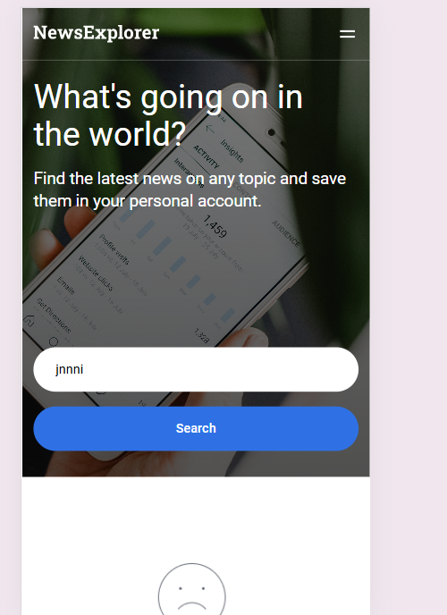
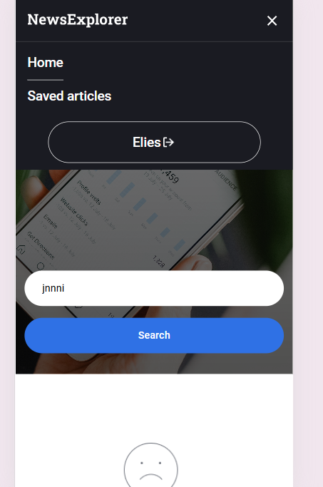
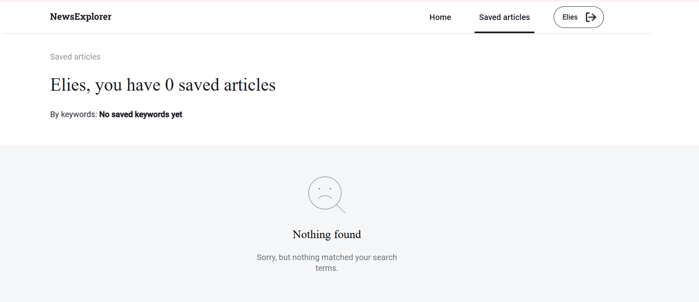

# New Explorer

A React application that allow users to search for news articles, save their favorites, and mangae them in a personal accounts.

## Features

- Search for news articles by keyword and title
- Display results as interactive cards
- Save and remove articles
- Authentication UI (login & registration modals)
- Saved Article page
- Loading state ("Searching for news...")
- Empty state ("Nothing found")
- Fully reponsive (desktop, tablet, and mobile)

## Tech Stack

- React
- React Router DOM
- Vite
- CSS (Flexbox and Grid)
- News API

## API

This project uses the News API to fetch real time news data: https://newsapi.org/

## Project Structure

```text
se_project_news-explorer/
├── .env
├── eslint.config.js
├── index.html
├── package-lock.json
├── package.json
├── vite.config.js
├── public/
├── src/
│   ├── assets/
│   ├── components/
│   │   ├── About/
│   │   ├── App/
│   │   ├── Footer/
│   │   ├── Header/
│   │   ├── LoginModal/
│   │   ├── Main/
│   │   ├── ModalWithForm/
│   │   ├── Navigation/
│   │   ├── NewsCard/
│   │   ├── NewsCardList/
│   │   ├── Preloader/
│   │   ├── RegisterModal/
│   │   ├── RegistrationSuccessModal/
│   │   ├── SavedNews/
│   │   └── SearchForm/
│   ├── fonts.css
│   ├── index.css
│   ├── main.jsx
│   ├── utils/
│   └── vendor/
└── README.md
```

## Screenshots / Demo

### Live Demo

 - Project Pitch Video
 
 Check out [this video]( https://drive.google.com/file/d/1kRUMo8oSAKmT6YtJJXRAVUDDm0TvnLvU/view?usp=drive_link), where I describe my 
 project and some challenges I faced while building it.


### Home Page



### Search Results



### Saved Articles



### Account Modal



### Mobile View



### Mobile Menu



### Empty State



## Installation steps

- npm install
- npm run preview

## Environment variables

create a file : .env

use this for API Key : VITE_NEWS_API_KEY=your_api_key_here

## Responsive design note

- desktop
- tablet
- mobile

## My Repository

My Repository will be found right here this link:
